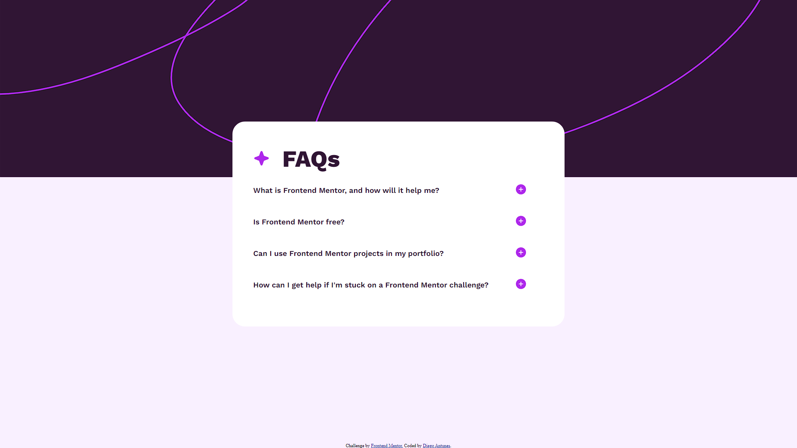

# Frontend Mentor - FAQ accordion solution

Solution to second FEM challenge.
Challenge link: (https://www.frontendmentor.io/challenges/faq-accordion-wyfFdeBwBz)

## Table of contents

- [Overview](#overview)
  - [The challenge](#the-challenge)
  - [Screenshot](#screenshot)
  - [Links](#links)
- [My process](#my-process)
  - [Built with](#built-with)
  - [What I learned](#what-i-learned)
  - [Continued development](#continued-development)
  - [Useful resources](#useful-resources)
- [Author](#author)

## Overview

- The idea was to create an Accordion menu with 4 questions, each revealing its hidden answer upon being clicked.

### The challenge

Users should be able to:

- Hide/Show the answer to a question when the question is clicked (done)
- Navigate the questions and hide/show answers using keyboard navigation alone (to-do)
- View the optimal layout for the interface depending on their device's screen size (to-do)
- See hover and focus states for all interactive elements on the page (done)

### Screenshot

### Links

- Live Site URL: [https://dian-new-dev.github.io/FEM-Challenge-2-FAQ-Accordion/]

## My process

### Built with

- HTML
- CSS 
- CSS Grid
- Javascript

### What I learned

- Modular JS functions: for the first time, I didn't wrote one single giant Eventlistener containing every single function. It makes it much easier to manage the code.
- Learned how to use classList.toggle(), though I ended up creating two functions to add and remove classes for better interactivity.

### Continued development

- This challenge isn't done. I still have to add: 1) keyboard navigation 2) responsive layout. Soon.

### Useful resources

- [https://www.w3schools.com/howto/howto_js_toggle_class.asp] - JS toggle

## Author

- Website - don't have yet
- Frontend Mentor - [@dian-New-Dev](https://www.frontendmentor.io/profile/Dian-New-Dev)
- Twitter - don't have
